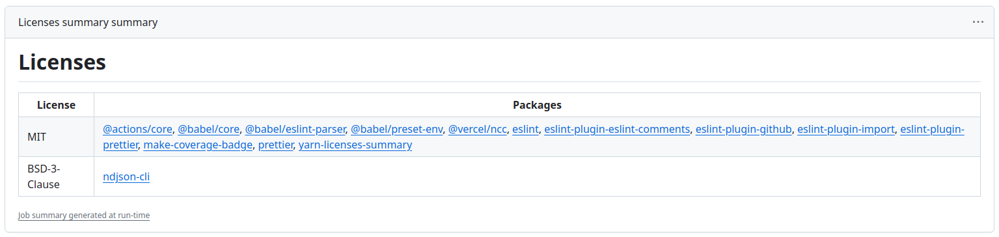

# GitHub Yarn-licenses-summary Action
**yarn-licenses-summary** uses the output of [yarn-plugin-licenses](https://github.com/mhassan1/yarn-plugin-licenses) to create a [Job Summary](https://github.blog/2022-05-09-supercharging-github-actions-with-job-summaries/) listing all the licenses used in a yarn project like the on below.



# requirements
This action requires [ndjson-cli](https://github.com/mbostock/ndjson-cli). You can either add it to your project, via `yarn add ndjson-cli` or you can add it to your workflow by adding the below lines before using `yarn install`. (You can't install with a `--frozen lockfile` then)

```yaml
- name: Add njson-cli
  id: add-njson-cli
  run: yarn add ndjson-cli
```

# Usage
Below is an example of how to use this action in a workflow.

```yaml
name: Licenses Summary

# Controls when the action will run.
on: [push, pull_request]

jobs:
  licenses-summary:
    name: Licenses summary
    runs-on: ubuntu-latest

    steps:
      - name: Checkout
        id: checkout
        uses: actions/checkout@v4

      - name: Setup Yarn
        id: setup-yarn
        uses: actions/setup-node@v4
        with:
          node-version: 20
          cache: yarn

      - name: Install Dependencies
        id: yarn-install
        run: yarn install

      - name: Get Licenses
        id: get-licenses
        run: echo licenses=$(yarn licenses list --json | yarn ndjson-reduce) >> $GITHUB_OUTPUT

      - name: Create Licenses Summary
        id: create-summary
        uses: derwehr/yarn-licenses-summary@v1
        with:
          licenses: ${{ steps.get-licenses.outputs.licenses }}
```
